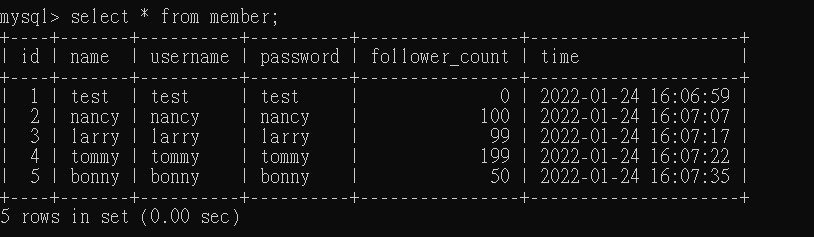

<<<<<<< HEAD
# week5 assignment

## 要求三：SQL CRUD
- insert into member (name,username,password)values('test','test','test');
insert into member 

- select * from member;

- select * from member order by time desc;

- select * from member order by time desc limit 1,3;

- select * from member where username='test';

- select * from member where username='test' and password='test';

- update member set name='test2' where username='test';


## 要求四：SQL Aggregate Functions
- select count(id) from member;

- select sum(follower_count) from member;

- select avg(follower_count) from member;


## 要求五：SQL JOIN (Optional)
- select content,username from member join message on member.id=message.member_id;

- select content,username from member join message on member.id=message.member_id where username='test';

=======
## 要求三：SQL CRUD
```
insert into member (name,username,password)values('test','test','test');
```

```
 select * from member;
 ```

```
select * from member order by time desc;
```

```
select * from member order by time desc limit 1,3;
```

```
select * from member where username='test';
```

```
select * from member where username='test' and password='test';
```

```
update member set name='test2' where username='test';
```


## 要求四：SQL Aggregate Functions
```
select count(id) from member;
```

```
select sum(follower_count) from member;
```

```
select avg(follower_count) from member;
```


## 要求五：SQL JOIN (Optional)
```
select content,username from member join message on member.id=message.member_id;
```

```
select content,username from member join message on member.id=message.member_id where username='test';
```

>>>>>>> 10ba2f2a30c5d6ed73b9e1f6a725a1533b853b03
